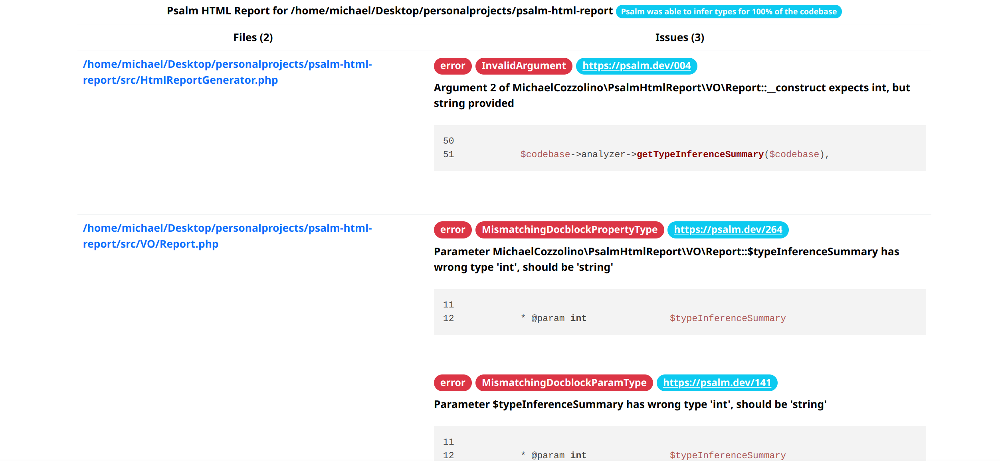

# Psalm Html Report

An html report plugin for [Psalm](https://github.com/vimeo/psalm) v5.0+.

## Installation:

```
composer require --dev michaelcozzolino/psalm-html-report
vendor/bin/psalm-plugin enable MichaelCozzolino\PsalmHtmlReport\Plugin
```

## Usage

While enabled, the plugin will generate an html report file named `report.html` every time Psalm
is run without the `--report` command-line option.

## Configuration

The default output file is `report.html` in the current working directory. To change this, edit the
plugin's settings in `psalm.xml` or `psalm.xml.dist` to add an `outputFilepath` element. All paths are relative to the
current working directory.
Be aware that in order for the plugin to work, the specified output directory must exist.

```xml

<plugins>
    <pluginClass class="MichaelCozzolino\PsalmHtmlReport\Plugin">
        <outputFilePath>./custom-dir/html-report.html</outputFilePath>
    </pluginClass>
</plugins>
```

The report will not be written if another report is being requested with the `--report` command-line option.

If the command-line option `--show-info` is set, then the info level messages will also be added to the report.

## Screenshots


